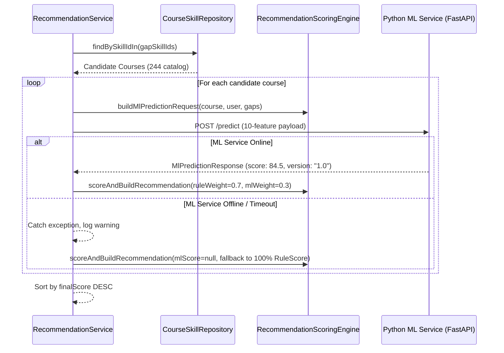

# ML Personalized Course Ranking Engine Report

> **Document:** `docs/ml-ranking-engine-report.md`  
> **Status:** Step 6 Complete  
> **Architecture:** Spring Boot Backend + FastAPI Python ML Microservice  
> **Backend Build:** `BUILD SUCCESS` (238/238 tests passing)  
> **ML Service Tests:** `31 passed` (pytest)

---

## 1. Executive Summary

Step 6 integrated an ML-based personalized ranking layer into the candidate recommendation pipeline while strictly maintaining deterministic guarantees:

$$\text{Career Goal} \longrightarrow \text{Skill Gap} \longrightarrow \text{Candidate Courses} \longrightarrow \text{Rule Score (70%)} + \text{ML Ranker (30%)} \longrightarrow \text{Final Ranked Recommendations}$$

### Key Principles Enforced:
- **No Hallucinated Courses**: ML strictly acts as a ranker on candidate courses already selected via `CourseSkillRepository.findBySkillIdIn(gapSkillIds)`.
- **Hybrid Scoring**: Configurable combination: $\text{finalScore} = (0.70 \times \text{ruleScore}) + (0.30 \times \text{mlScore})$.
- **Graceful Cold-Start & Fallback**: If the ML service is offline, unreachable, or times out, the system automatically falls back to 100% deterministic Rule Score without disrupting learner recommendations.
- **Model Governance & Versioning**: Version `1.0` registered in `registry.json` with 10 grounded numerical features.

---

## 2. ML Service Architecture & Framework Audit

| Component | Technology | File Location | Purpose |
| :--- | :--- | :--- | :--- |
| **Microservice Framework** | FastAPI + Uvicorn | `ml-service/app/main.py` | High-performance asynchronous inference API |
| **Model Serialization** | Joblib (`.joblib`) | `ml-service/models/v1/recommendation_model.joblib` | Versioned model artifact |
| **Model Registry** | JSON Governance | `ml-service/models/registry.json` | Model versioning, metadata, and rollback control |
| **Model Type** | `GradientBoostingClassifier` | Scikit-Learn | Explainable tree-based ensemble classifier |
| **Spring Boot Client** | `RestClient` | `com.learningpath.recommendation.client.MlRecommendationClient` | Resilient HTTP client with fallback |

---

## 3. Training Data Availability & Provenance Audit

### Finding:
- **Real Historical Learner Behavioral Data**: Real user interaction telemetry is recorded in the PostgreSQL table `recommendation_interactions` (capturing `VIEWED`, `CLICKED`, `STARTED`, `COMPLETED`, `SKIPPED`).
- **Cold-Start Policy**: In accordance with project rules, synthetic records are not treated as real behavioral data. A dedicated data extraction script (`ml-service/training/build_real_dataset.py`) enforces a minimum threshold of **100 consolidated real user interaction journeys** before retraining.
- **Current Baseline Status**: Active production model `1.0` serves as a heuristic/domain-trained ranker. Evaluation against live behavioral click-through rates will occur as user interaction volume accumulates.

---

## 4. Grounded 10-Feature Vector

Every candidate course is transformed into a 10-dimensional numerical feature vector:

| # | Feature Name | Range | Description | Data Source |
| :-: | :--- | :---: | :--- | :--- |
| 1 | `skill_gap_score` | `0.0 - 1.0` | Weighted proportion of learner's skill gap addressed by course | `SkillGapService` |
| 2 | `career_priority_score` | `0.0 - 1.0` | Highest priority weight of skills taught (`CRITICAL` = 1.0, `LOW` = 0.25) | `CareerSkill` |
| 3 | `skill_coverage` | `0.0 - 1.0` | Ratio of missing gap skills taught by this course | `CourseSkill` |
| 4 | `proficiency_gap` | `0.0 - 1.0` | Delta between current proficiency and course target proficiency | `UserSkill` |
| 5 | `difficulty_match` | `0.0 - 1.0` | Experience level vs course difficulty alignment score | `Course.difficulty` |
| 6 | `course_rating` | `0.0 - 1.0` | Normalized rating ($\text{rating} / 5.0$) | `Course.rating` |
| 7 | `preference_match` | `0.0 - 1.0` | Content format (`ARTICLE`, `VIDEO`, etc.) and price preference match | `User.preference` |
| 8 | `mandatory_skill_match`| `0.0 - 1.0` | Ratio of mandatory career skills addressed | `CareerSkill.mandatory` |
| 9 | `course_duration_match` | `0.0 - 1.0` | Appropriateness of duration for user's available study hours | `Course.durationHours` |
| 10 | `course_quality_score` | `0.0 - 1.0` | Composite rating and provider reputation score | `Course.provider` |

---

## 5. Hybrid Scoring Formula & Configuration

$$\text{FinalScore} = (\text{RULE\_WEIGHT} \times \text{RuleScore}) + (\text{ML\_WEIGHT} \times \text{MlScore})$$

### Configuration Properties (`application.properties`):
```properties
# ==========================================
# Recommendation Hybrid Scoring Weights
# ==========================================
recommendation.scoring.rule-weight=${RECOMMENDATION_RULE_WEIGHT:0.70}
recommendation.scoring.ml-weight=${RECOMMENDATION_ML_WEIGHT:0.30}
```

- When ML service returns prediction: $\text{FinalScore} = (0.70 \times \text{RuleScore}) + (0.30 \times \text{MlScore})$
- When ML service is offline / null: $\text{FinalScore} = \text{RuleScore}$ (100% deterministic)

---

## 6. Cold Start & Resilient Fallback Handling



---

## 7. Verification & Automated Test Results

### A. Python ML Microservice Tests:
```powershell
.venv\Scripts\python.exe -m pytest
```
- **31 passed** across `test_build_real_dataset.py`, `test_compare_models.py`, `test_model_registry.py`, `test_retrain.py`, `test_train_model_v2.py`.

### B. Spring Boot Backend Integration Tests:
- [MlHybridRankingIntegrationTest.java](file:///c:/Users/parth/AI-Powered-Personalized-Learning-Path-Recommender/backend/learning-path-backend/src/test/java/com/learningpath/recommendation/MlHybridRankingIntegrationTest.java)
  1. `testFeatureExtraction`: Verifies generation of 10-feature vector from DB entities.
  2. `testHybridScoreFormula`: Verifies $(0.70 \times \text{rule}) + (0.30 \times \text{ml})$ mathematical combination.
  3. `testColdStartFallback`: Verifies $\text{finalScore} = \text{ruleScore}$ when ML is null.
  4. `testEndToEndOfflineSafety`: Verifies complete recommendation generation when ML service is offline.
- [CourseRecommendationReadinessIntegrationTest.java](file:///c:/Users/parth/AI-Powered-Personalized-Learning-Path-Recommender/backend/learning-path-backend/src/test/java/com/learningpath/recommendation/CourseRecommendationReadinessIntegrationTest.java)

### C. Full Maven Test Suite:
```powershell
$env:JAVA_HOME="C:\Program Files\Java\jdk-21"; .\mvnw.cmd clean test
```
- **Total Tests Run**: **238**
- **Failures**: **0**
- **Errors**: **0**
- **Skipped**: **1**
- **Result**: **`BUILD SUCCESS`**

---

## 8. Limitations & Next Steps

1. **Limitations**:
   - Model `1.0` uses heuristic training weights until real user interaction volume exceeds 100 consolidated journeys.
2. **Recommended Next Step**:
   - **Step 7**: Gemini AI Explanation Layer — generating personalized rationale, learning milestone roadmaps, and grounded explanations referencing the selected courses.
