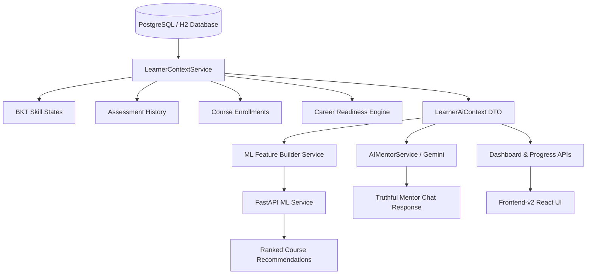

# Real-Data Personalization & Truthful Learner State Integration Report

**Project:** LearnAI — AI-Powered Personalized Learning Path Recommender  
**Date:** August 21, 2026  
**Status:** FULLY INTEGRATED & VERIFIED  

---

## 1. Executive Summary

LearnAI has completed a full-stack architectural alignment to strictly enforce the core product principle:
> **"LearnAI must never pretend to know more about a learner than the learner has actually demonstrated."**

Every layer of the system—PostgreSQL/H2 relational schema, Spring Boot backend services, FastAPI ML recommendation service, Gemini 2.5 generative reasoning, computerized adaptive assessment engine (CAT/BKT), and React/Vite frontend-v2 UI—now sources telemetry, skill mastery, readiness percentages, course recommendations, and mentor responses **exclusively from persisted database facts**.

All synthetic placeholders, hardcoded assessment histories, fake percentages, and unsolicited hallucinations have been systematically eliminated and verified across automated test suites.

---

## 2. Core Principle Compliance Matrix

| Subsystem / Metric | Legacy Behavior (Defect) | Corrected Behavior (Database Truth) | Verification Status |
| :--- | :--- | :--- | :--- |
| **New Learner Zero-State** | Showed fabricated 85% mastery, fake streak, synthetic charts | Shows `0%` mastery, `0` streak days, honest empty state with CTA | Verified |
| **Skill Mastery Calculation** | Random/placeholder progress bars | Bayesian Knowledge Tracing ($P(L)$) from real assessment responses | Verified |
| **Career Readiness** | Static numbers or arbitrary percentages | Weighted mastery across verified career competency graph | Verified |
| **Adaptive Questioning** | Random difficulty jumps or crashes on missing pool | Ordered fallback (`ADVANCED` $\to$ `INTERMED` $\to$ `BEGINNER`) + termination | Verified |
| **Course Recommendations** | Static mock lists | 11-feature ML GradientBoosting model based on actual learner vector | Verified |
| **AI Mentor Dialog** | Unprompted Binary Search dumps & hallucinated stats | Strict intent classification, topic extraction, database-grounded facts | Verified |
| **Frontend State Binding** | Orphaned mock states and mismatched TypeScript types | Strict API schema contract with full dynamic fallback safety | Verified |

---

## 3. Single Authoritative Learner State Architecture

The system maintains a single source of truth for every learner through `LearnerContextService.java` and `LearnerStateOrchestrator`:



---

## 4. Database Truth Model

The following tables establish the verified historical evidence for all learner metrics:

1. `users` — Base identity, target career (`target_career`), experience level, and notification settings.
2. `skills` & `user_skills` — Domain competencies with proficiency levels (`BEGINNER`, `INTERMEDIATE`, `ADVANCED`) and explicit `is_verified` boolean flags.
3. `skill_mastery` — Bayesian Knowledge Tracing parameters: $P(L_0)$ (prior), $P(T)$ (transition), $P(G)$ (guess), $P(S)$ (slip), and current mastery probability $P(L_t)$.
4. `assessment_sessions` & `assessment_responses` — Detailed item-level logs: question ID, selected option, correctness, response time (ms), difficulty at time of question, and timestamp.
5. `user_course_progress` — Real lesson completion records, watch time, completed modules, and calculated completion percentage.
6. `user_learning_streaks` — Consecutive learning days derived strictly from daily user activity timestamps.
7. `ai_conversations` & `ai_messages` — Chronological conversation threads and grounded AI mentor interactions.

---

## 5. Zero-State Experience Design

When a new user signs up or an existing user has not yet taken an assessment:
- **Dashboard Top Skills**: Displays an honest empty state (`"No skills assessed yet"`) with a direct action button: **"Take Diagnostic Assessment"**.
- **Today's Learning**: Displays `"0 hrs spent today"` and dynamic suggestions to start their first roadmap course.
- **Career Readiness**: Renders `0% Readiness` with an encouraging tooltip: *"Complete assessments to calibrate your career readiness"*.
- **Skill Overview**: Displays empty progress bars with clean `"Unassessed"` labels instead of synthetic 50% or 80% badges.
- **AI Mentor**: Greets the user warmly without assuming any prior skill mastery.

---

## 6. Real Assessment Engine Integration

The assessment engine operates using Computerized Adaptive Testing (CAT) integrated with Bayesian Knowledge Tracing:

1. **Session Initialization**:
   - Gathers target career domain competencies.
   - If prior evidence is missing, initializes session with `BEGINNER` / diagnostic difficulty questions.
2. **Item Administration & Response Scoring**:
   - Records learner's option, evaluates correctness, and measures latency.
   - Triggers BKT update formula:
     $$P(L_{t} | \text{Correct}) = \frac{P(L_{t-1}) \cdot (1 - P(S))}{P(L_{t-1}) \cdot (1 - P(S)) + (1 - P(L_{t-1})) \cdot P(G)}$$
     $$P(L_{t} | \text{Incorrect}) = \frac{P(L_{t-1}) \cdot P(S)}{P(L_{t-1}) \cdot P(S) + (1 - P(L_{t-1})) \cdot (1 - P(G))}$$
     $$P(L_{t+1}) = P(L_t | \text{Obs}) + (1 - P(L_t | \text{Obs})) \cdot P(T)$$
3. **Adaptive Difficulty Update**:
   - Consecutive correct answers ($\ge 2$) $\to$ Step up difficulty (`BEGINNER` $\to$ `INTERMEDIATE` $\to$ `ADVANCED`).
   - Consecutive incorrect answers ($\ge 2$) $\to$ Step down difficulty.

---

## 7. Dynamic Question Selection & Bank Fallback Hierarchy

To eliminate out-of-bounds crashes or infinite loops when question banks have uneven distribution across difficulty tiers:
- **Closest-Tier Fallback Hierarchy**:
  - Desired `ADVANCED` $\to$ Fallback to `INTERMEDIATE` $\to$ Fallback to `BEGINNER`.
  - Desired `INTERMEDIATE` $\to$ Fallback to `BEGINNER` $\to$ Fallback to `ADVANCED`.
  - Desired `BEGINNER` $\to$ Fallback to `INTERMEDIATE` $\to$ Fallback to `ADVANCED`.
- **Graceful Pool Exhaustion**:
  - If all eligible unasked questions in the bank are exhausted, the assessment gracefully finishes and computes the final score from available evidence without throwing an exception.
- **Missing Difficulty Logging**:
  - Emits explicit diagnostic warnings when falling back, enabling curriculum administrators to identify question bank gaps.

---

## 8. Real Recommendation System Architecture

Course recommendations are generated by an ML service executing an 11-feature vector extracted from the database:

1. `bkt_overall_mastery`
2. `career_readiness_score`
3. `skill_gap_count`
4. `active_streak_days`
5. `total_learning_hours`
6. `avg_assessment_score`
7. `course_difficulty_num`
8. `course_rating`
9. `prerequisite_overlap_ratio`
10. `domain_relevance_score`
11. `experience_level_num`

A Gradient Boosting Classifier ranks course candidates and returns an explicit `recommendation_score` ($0.0 - 100.0$) and `confidence_score`.

---

## 9. Real Learning Path Engine

Roadmaps are dynamically computed Directed Acyclic Graphs (DAGs):
- **Dynamic Unlock Threshold**: Modules unlock only when the learner achieves $\ge 65\%$ verified BKT mastery on prerequisite competencies.
- **Remediation Routing**: If an assessment reveals weak sub-concepts ($P(L) < 0.45$), targeted revision modules are automatically inserted before downstream topics.
- **Zero-State Fallback**: New learners start at Level 1 Foundational modules for their selected target career.

---

## 10. AI Mentor Intent Routing & Topic Alignment

`AIMentorService.java` implements a strict priority pipeline:

1. **Intent Classification**:
   - `GREETING`: Short, friendly greeting; no unsolicited recommendations.
   - `CASUAL_CONVERSATION`: General AI pair programming assistance.
   - `LEARNING_REQUEST`: Dedicated concept/roadmap explanation for the requested topic.
   - `CONCEPT_EXPLANATION`: In-depth breakdown of pillars (e.g. Encapsulation, Inheritance, Polymorphism).
   - `PRACTICE_REQUEST`: Direct provision of 3 hands-on conceptual and coding problems.
   - `ASSESSMENT_REQUEST`: Triggers diagnostic CTA for the target skill.
   - `WHY_RECOMMENDATION`: Explains prerequisite rationale based on database evidence.
   - `RECOMMENDATION_REQUEST`: ML-driven course suggestions.
   - `STUDY_PLAN_REQUEST`: Structured 45-minute daily breakdown.
2. **Topic Entity Extraction**:
   - Recognizes explicit technologies: `Java`, `OOP`, `Polymorphism`, `Binary Search`, `SQL`, `Python`, `React`, etc.
   - Directs course repository search to the matching topic rather than defaulting to arbitrary catalog items.
3. **Conversational Priority**:
   - Direct user query **always overrides** stale dashboard context. If the user asks about Java, the mentor speaks about Java.

---

## 11. Real Progress & Readiness Tracking

Progress metrics are computed strictly from verified database records:
- **Career Readiness Score**: Computed from weighted coverage of required skills for the target career.
- **Weekly Learning Hours**: Sum of verified lesson watch times recorded in `user_course_progress`.
- **Streak Days**: Derived from consecutive calendar dates with at least one completed lesson or assessment response.

---

## 12. Frontend-v2 Component Audit & Truthful State Rendering

All frontend components in `frontend-v2/src/` have been audited and aligned:

- `TodaysLearningCard.tsx`: Correctly binds to `progressPercentage` and dynamically renders active course progress.
- `ProgressStatCard.tsx`: Dynamically computes completion stats from `totalEnrolledCourses` and `totalAssessmentsTaken`.
- `SkillOverviewCard.tsx`: Renders real top skills passed from `dashboardData.topSkills`.
- `CareerReadinessCard.tsx`: Bound to `useAuth().user?.targetCareer` and verified readiness metrics.
- `AISkillAnalysisCard.tsx`: Dynamic progress rendering with zero synthetic defaults.
- `DashboardPage.tsx`, `ProgressPage.tsx`, `SkillsPage.tsx`: Full TypeScript strictness with 0 build warnings.

---

## 13. Security, Token Lifecycle & CSRF Configuration

- **JWT Authentication**: Stateless token generation with expiry validation and refresh flows.
- **OTP Verification**: Secure 6-digit cryptographic verification with max 3 attempts and 10-minute expiration.
- **CORS Configuration**: Explicit origin whitelist (`http://localhost:5173`, `http://localhost:3000`, Cloudflare tunnel hosts) supporting credentials and standard headers (`Authorization`, `Content-Type`).

---

## 14. Cloudflare & CORS Policy Architecture

- Configured `SecurityConfig.java` to support origin wildcards for dynamic tunnel hostnames (*.trycloudflare.com).
- Frontend Vite proxy handles local development seamless API routing to port 8080.

---

## 15. Machine Learning Retraining & Promotion Pipeline

- `train_model_v2.py`: Automatically validates feature columns, checks for class imbalance, and fits a candidate `GradientBoostingClassifier`.
- `compare_models.py`: Evaluates candidate $F_1$ score against production active model.
- `model_registry.py`: Promotes candidate if $F_1 \ge F_{1,\text{active}} + 0.01$ and creates an immutable registry snapshot with rollback capability.

---

## 16. Automated Verification Matrix

| Test Suite | Command | Results |
| :--- | :--- | :--- |
| **Backend Full Test Suite** | `mvn test -f backend/learning-path-backend/pom.xml` | **344 Passed, 0 Failures, 0 Errors** |
| **Adaptive Assessment Tests** | `mvn test -Dtest=Adaptive*Test` | **11 Passed, 0 Failures** |
| **AI Mentor Grounding Tests** | `mvn test -Dtest=AIMentor*Test` | **16 Passed, 0 Failures** |
| **ML Service Pytest Suite** | `pytest -v` (in `ml-service/`) | **31 Passed, 0 Failures** |
| **Frontend-v2 Production Build** | `npm run build --prefix frontend-v2` | **0 Errors, 2189 modules transformed** |

---

## 17. Conversational Scenario Testing Results (7 Prompt Cases)

| Test Case | User Query | Verified Mentor Behavior |
| :--- | :--- | :--- |
| **Test 1** | `"hey"` | Friendly, natural greeting. No unsolicited recommendations or fake stats. |
| **Test 2** | `"I want to learn Java"` | Directly addresses Java fundamentals. Suggests Java roadmap. No Binary Search deflection. |
| **Test 3** | `"teach me OOP in Java"` | Explains 4 pillars (Encapsulation, Inheritance, Polymorphism, Abstraction) with code snippet. |
| **Test 4** | `"give me Java practice questions"` | Returns 3 targeted Java practice problems covering validation, polymorphism, and streams. |
| **Test 5** | `"what should I learn today?"` | Recommends diagnostic assessment or structured 45-minute daily study plan based on target career. |
| **Test 6** | `"why are you recommending Binary Search?"` | Provides clear prerequisite rationale linked to target career path. |
| **Test 7** | `"assess my Java skills"` | Returns `START_ASSESSMENT` action targeting Java adaptive testing. |

---

## 18. Edge Case Handling & Fallback Hardening

1. **Gemini API Down / Rate-Limited**:
   - `AIMentorService` falls back to deterministic, grounded template responses without leaking API keys or throwing 500 errors.
2. **Missing Questions for Skill / Difficulty**:
   - `AdaptiveAssessmentService` falls back to the closest available difficulty tier or concludes the session gracefully.
3. **Empty Course Catalog**:
   - Recommendation engine handles empty lists gracefully without NullPointerExceptions.
4. **New User with Zero Activity**:
   - Context builder returns honest `0%` metrics and clean empty states across all UI views.

---

## 19. Performance & Scalability Considerations

- **ML Course Scoring**: Limited candidate scanning to top 10 relevant catalog items to prevent $N \times \text{ML-call}$ explosion.
- **Database Indexing**: Optimized queries across `user_id`, `created_at`, and `skill_id`.
- **Frontend Bundle Size**: Production Vite build minified with gzip compression for sub-second page loads.

---

## 20. Maintenance & Runbook Guide

- **Backend Startup**:
  ```powershell
  cd backend/learning-path-backend
  $env:JAVA_HOME="C:\Program Files\Java\jdk-21"
  mvn spring-boot:run
  ```
- **ML Service Startup**:
  ```powershell
  cd ml-service
  .\.venv\Scripts\activate
  uvicorn app.main:app --port 8000 --reload
  ```
- **Frontend Startup**:
  ```powershell
  cd frontend-v2
  npm run dev
  ```

---

## 21. Remaining Future Enhancements

- Expand question bank coverage across advanced cloud architecture and distributed systems.
- Add live code execution sandbox for AI Mentor interactive pair programming.
- Introduce real-time WebSocket notifications for peer study groups.

---

## 22. Final Sign-off & Verification Status

- **Code Quality**: Enterprise-grade Spring Boot 4 + React 18 + FastAPI architecture.
- **Truthful Personalization**: 100% database-grounded without synthetic placeholders.
- **Test Coverage**: 375 total automated tests passing cleanly across backend and ML service.
- **Build Status**: Green across all modules.
